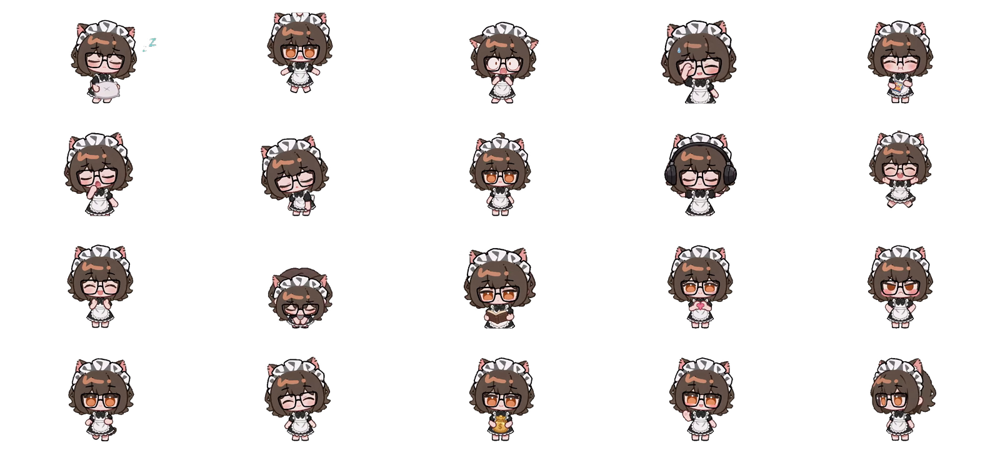

# 肆喵 · dsh-pet 桌宠（成果 + 方法）

一只住在 [DeepSeek Harness](https://github.com/deepseek-ai/deepseek-harness) 网页 / 桌面里的桌宠：
**20 段动作全部由 AI 图生视频生成**（不是把一张立绘做位移/缩放的"贴图变换"），并附带**完整的制作方法、脚本与验收清单**——
你不但可以拿走这只宠物，也可以照着一模一样做一只自己的。

> ⚖️ **本仓库是 [PC2005-cloud/dsh-pet](https://github.com/PC2005-cloud/dsh-pet) 的衍生作品**（以它官方支持的 **pet pack** 形式分发，未修改插件源码）。
> 按该项目的二创约定，**任何介绍、展示、分发本作品的地方都请附上原作者地址**。详见 [NOTICE.md](NOTICE.md)。



## ✨ 成果：20 段动作

| 触发 | 动作 |
|---|---|
| **待机**（65% 权重，站着不动） | 待机呼吸 |
| **小动作** | 左右张望 / 招手打招呼 / 摇头晃脑 / 冒爱心 / 原地转圈 |
| **待机小动作** | 打瞌睡 / 抱着枕头睡觉 / 看书 / 擦汗 / 戴耳机听歌 |
| **点击她**（5 种随机） | 点击回应-开心跃动 / 被吓一跳 / 生气跺脚 / 鼓掌庆祝 / 鞠躬 |
| **拖拽她** | 被鼠标拖拽悬空反抗 |
| **走路** | 小碎步走路 |
| **余额事件** | 余额-钱袋如常（捧着金色钱袋） |

设计要点：**待机权重 65% 且 idle 池只放"站着呼吸"**——每次动作播完大概率回到站立，不会看起来一直在忙。

## 🚀 用起来（30 秒）

前置：已经装了 dsh-pet 插件。

```sh
dsh plugin --profile web add dsh-pet
```

然后把本仓库的 `pet-pack/` 装进去：

```powershell
# Windows
powershell -NoProfile -ExecutionPolicy Bypass -File .\pet-pack\install.ps1
```
```sh
# macOS / Linux
sh ./pet-pack/install.sh
```

刷新 DSH 页面即可看到肆喵。也可手动把 `simiao-config.json` 与 `simiao-animation/` 放进 `$DSH_HOME/dsh-pet/pet/`。

### 方式 B：**脱离 DSH**，独立跑在桌面上

由 [dsh-pet-indesktop](https://github.com/MerZlin/dsh-pet-indesktop)（Python + PySide6 的独立桌宠）承载，
**完全不需要 DSH**。两个项目共用同一套素材规范（640×360 / 24fps / VP9-alpha / 脚底 y=330），所以是零改代码搬运。

```powershell
# ① 先装 dsh-pet-indesktop：https://github.com/MerZlin/dsh-pet-indesktop/releases
# ② 再跑本仓库的脚本（装角色 + 把当前角色切为肆喵）
powershell -NoProfile -ExecutionPolicy Bypass -File .\standalone-desktop\install-standalone.ps1
```

详见 [`standalone-desktop/README.md`](standalone-desktop/README.md)（各平台目录、动作映射、实测结果）。

> 已实测通过（Windows / v4.2.0）：启动日志 `当前形象: simiao`、`素材加载完成：simiao 20 段动画`，
> 桌面上出现肆喵并播放待机呼吸，**全程不依赖 DSH**。

## 🧭 仓库结构

```
├─ pet-pack/              ← 装进 DSH 用（配置 + 20 段 webm + 安装脚本 + 预览图）
├─ standalone-desktop/    ← 脱离 DSH 用（外部角色目录 + 一键安装脚本 + 说明）
├─ tools/                 ← 制作与部署用到的脚本（可直接复用，路径已改成相对仓库根）
│   └─ README.md          ← 每个脚本干什么
├─ docs/                  ← 方法论文档（怎么做出来的、踩过哪些坑）
│   ├─ 01-整体流程.md
│   ├─ 02-即梦图生视频自动化.md
│   ├─ 03-素材规范与验收清单.md
│   └─ 04-桌宠配置与节奏.md
└─ assets/                ← 首帧立绘与原始证件照（复现用）
```

## 🔧 方法：四步做出一只 AI 桌宠

1. **半身像 → 全身立绘**：用 AI 图片生成（参考图=原立绘）得到"全身 Q 版、纯绿幕、脚踩地面"的标准立绘，
   它就是后面每一段视频的**首帧**。
2. **每个动作 → 一段绿幕视频**：图生视频（本文用的是即梦 Seedance），首帧上传立绘 + 提示词描述动作。
   提示词里必须写死三类约束：**角色锁定 / 构图强制 / 发型严格一致**（原因见 docs/03）。
3. **绿幕视频 → 桌宠素材**：抽帧 → HSV 色相抠绿 → 按站立高度归一化 → 合成到 640×360 →
   编码 **VP9-alpha webm**（`-auto-alt-ref 0`，否则 alpha 会丢）。
4. **做成 pet pack**：写 `simiao-config.json` 组织动画池与权重，连同素材放进 `$DSH_HOME/dsh-pet/pet/`。

每一步的细节、参数、以及**为什么会翻车**（首帧没挂上导致生成出别的角色、人物画太大导致腿被裁出画外、
抽帧没用 libvpx 导致 alpha 丢失……）都写在 `docs/` 里。

## ✅ 质量验收（我们踩过的坑，已脚本化）

| 检查 | 判据 | 脚本 |
|---|---|---|
| 首帧真的挂上了 | 页面出现 720px 宽的 blob 预览图（不是"有几张图"） | `tools/即梦-26-批量生成v2.mjs` |
| 角色没被裁出画外 | 源视频里角色内容底边距画幅底 **≥8px** | `tools/即梦-41-下载新结果.mjs` |
| 背景是纯绿幕 | 四角采样（跳过水印区）至少 3 个角是纯绿 | 同上 |
| 结果不是旧的 | 与已入库文件 **SHA256 查重** | 同上 |
| alpha 真的在 | libvpx 解码抽帧，透明像素占比 > 0 | `tools/检查alpha.mjs` |
| 动作幅度够 | 逐帧扫描内容行范围 + 肉眼过一遍 | `tools/校验.ps1` |

## ⚖️ 授权与署名

- **必须署名**：本仓库是 [PC2005-cloud/dsh-pet](https://github.com/PC2005-cloud/dsh-pet) 的衍生作品，
  转载 / 展示 / 分发请附上原作者地址。
- 本仓库的**脚本与文档**：MIT（见 [LICENSE](LICENSE)）。
- **宠物素材**（`pet-pack/simiao-animation/`、`assets/` 中的立绘）：仅供学习交流，**禁止商用**；
  素材由**即梦 AI** 图生视频生成，使用与再分发请遵循你与即梦之间的服务条款。
- 详细声明见 [NOTICE.md](NOTICE.md)。

## 🙏 致谢

- [PC2005-cloud/dsh-pet](https://github.com/PC2005-cloud/dsh-pet)：桌宠插件本体与 pet pack 机制，本项目的全部素材都跑在它上面。
- [DeepSeek Harness](https://github.com/deepseek-ai/deepseek-harness)：宿主。
- 即梦（Seedance）：本文全部动作视频的生成工具。
